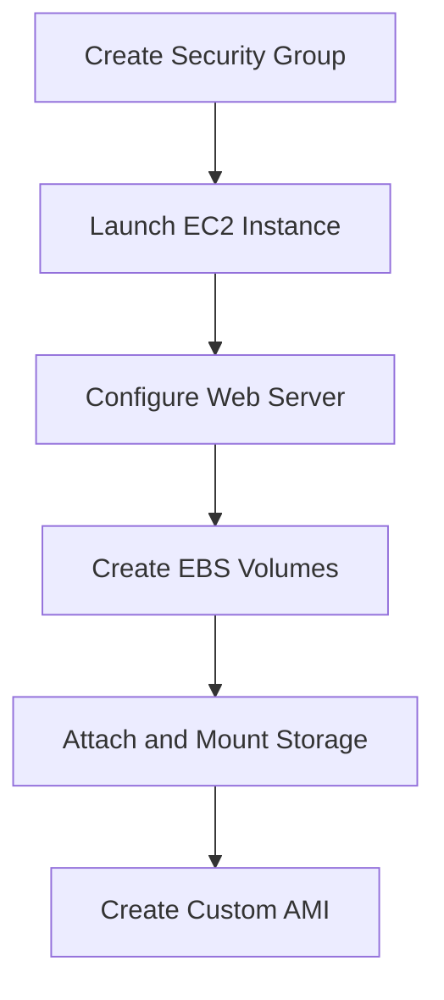
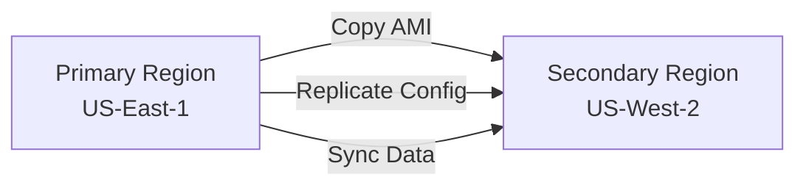

# Multi-Region Deployment Strategy

## Overview
This document outlines the multi-region deployment strategy for the XYZ Corporation web server infrastructure, implementing disaster recovery, high availability, and geographic redundancy across AWS regions.

## Architecture Strategy

### Regional Distribution
- **Primary Region**: US-East-1 (N. Virginia)
  - Production workloads
- **Secondary Region**: US-West-2 (Oregon)
  - Disaster recovery and backup

### Multi-Region Benefits
1. **Disaster Recovery**: Automatic failover capabilities
2. **Low Latency**: Serve users from nearest region
3. **Compliance**: Data residency requirements
4. **High Availability**: 99.99% uptime target

## Implementation Strategy

### Phase 1: Primary Region Setup


### Phase 2: Cross-Region Replication


## Deployment Patterns

### Active-Passive Pattern
- **Primary**: Handles all production traffic
- **Secondary**: Standby for disaster recovery
- **Failover**: Manual or automated based on health checks

### Active-Active Pattern (Future Enhancement)
- Both regions serve production traffic
- Load balancer distributes traffic geographically
- Real-time data synchronization required

## Regional Configuration Matrix

| Component | US-East-1 | US-West-2 | Notes |
|-----------|-----------|-----------|-------|
| EC2 Instance Type | t3.micro | t3.micro | Consistent sizing |
| EBS Volume Type | gp3 | gp3 | High performance |
| Security Groups | XYZ-WebServer-SG | XYZ-WebServer-SG-West | Region-specific |
| AMI | XYZ-Corp-WebServer-v1.0 | XYZ-Corp-WebServer-v1.0-West | Synchronized |
| Backup Strategy | Daily snapshots | Cross-region copy | Automated |

## Infrastructure as Code

### CloudFormation Template Structure
```
cloudformation/
├── master-template.yaml
├── nested-stacks/
│   ├── ec2-stack.yaml
│   ├── ebs-stack.yaml
│   ├── security-stack.yaml
│   └── ami-stack.yaml
└── parameters/
    ├── us-east-1-params.json
    └── us-west-2-params.json
```

## Automation Strategy

### CI/CD Pipeline for Multi-Region Deployment

```yaml
# .github/workflows/multi-region-deploy.yml
name: Multi-Region Deployment

on:
  push:
    branches: [main]
  pull_request:
    branches: [main]

jobs:
  deploy-primary:
    runs-on: ubuntu-latest
    steps:
      - uses: actions/checkout@v3
      - name: Configure AWS credentials
        uses: aws-actions/configure-aws-credentials@v2
        with:
          aws-access-key-id: ${{ secrets.AWS_ACCESS_KEY_ID }}
          aws-secret-access-key: ${{ secrets.AWS_SECRET_ACCESS_KEY }}
          aws-region: us-east-1
      
      - name: Deploy to US-East-1
        run: |
          aws cloudformation deploy \
            --template-file cloudformation/master-template.yaml \
            --stack-name xyz-infrastructure-east \
            --parameter-overrides file://parameters/us-east-1-params.json \
            --capabilities CAPABILITY_IAM

  deploy-secondary:
    runs-on: ubuntu-latest
    needs: deploy-primary
    steps:
      - uses: actions/checkout@v3
      - name: Configure AWS credentials
        uses: aws-actions/configure-aws-credentials@v2
        with:
          aws-access-key-id: ${{ secrets.AWS_ACCESS_KEY_ID }}
          aws-secret-access-key: ${{ secrets.AWS_SECRET_ACCESS_KEY }}
          aws-region: us-west-2
      
      - name: Deploy to US-West-2
        run: |
          aws cloudformation deploy \
            --template-file cloudformation/master-template.yaml \
            --stack-name xyz-infrastructure-west \
            --parameter-overrides file://parameters/us-west-2-params.json \
            --capabilities CAPABILITY_IAM
```

## Data Synchronization Strategy

### EBS Snapshot Replication
```bash
#!/bin/bash
# Cross-region snapshot replication script

SOURCE_REGION="us-east-1"
TARGET_REGION="us-west-2"
VOLUME_ID="vol-12345678"

# Create snapshot in source region
SNAPSHOT_ID=$(aws ec2 create-snapshot \
  --volume-id $VOLUME_ID \
  --region $SOURCE_REGION \
  --description "Cross-region backup $(date)" \
  --query 'SnapshotId' \
  --output text)

# Wait for snapshot completion
aws ec2 wait snapshot-completed \
  --snapshot-ids $SNAPSHOT_ID \
  --region $SOURCE_REGION

# Copy snapshot to target region
aws ec2 copy-snapshot \
  --source-region $SOURCE_REGION \
  --source-snapshot-id $SNAPSHOT_ID \
  --region $TARGET_REGION \
  --description "Cross-region copy of $SNAPSHOT_ID"
```

### AMI Synchronization
```bash
#!/bin/bash
# AMI cross-region synchronization

SOURCE_AMI="ami-12345678"
SOURCE_REGION="us-east-1"
TARGET_REGION="us-west-2"

# Copy AMI to target region
aws ec2 copy-image \
  --source-image-id $SOURCE_AMI \
  --source-region $SOURCE_REGION \
  --region $TARGET_REGION \
  --name "$(aws ec2 describe-images --image-ids $SOURCE_AMI --region $SOURCE_REGION --query 'Images[0].Name' --output text)-cross-region" \
  --description "Cross-region copy from $SOURCE_REGION"
```

## Disaster Recovery Procedures

### Failover Process
1. **Health Check Failure Detection**
   ```bash
   # Monitor primary region health
   aws ec2 describe-instance-status \
     --instance-ids i-primary \
     --region us-east-1
   ```

2. **DNS Failover (Route 53)**
   ```bash
   # Update Route 53 record to point to secondary region
   aws route53 change-resource-record-sets \
     --hosted-zone-id Z123456789 \
     --change-batch file://failover-changeset.json
   ```

3. **Secondary Region Activation**
   ```bash
   # Ensure secondary instance is running
   aws ec2 start-instances \
     --instance-ids i-secondary \
     --region us-west-2
   ```

### Recovery Testing Schedule
- **Monthly**: Automated failover tests
- **Quarterly**: Full disaster recovery drills
- **Annually**: Complete infrastructure rebuild tests

## Monitoring and Alerting

### Multi-Region Health Checks
```yaml
# CloudWatch alarms for both regions
Resources:
  PrimaryRegionAlarm:
    Type: AWS::CloudWatch::Alarm
    Properties:
      AlarmName: XYZ-Primary-Health-Check
      MetricName: StatusCheckFailed
      Namespace: AWS/EC2
      Statistic: Maximum
      Period: 300
      EvaluationPeriods: 2
      Threshold: 1
      ComparisonOperator: GreaterThanOrEqualToThreshold
      
  SecondaryRegionAlarm:
    Type: AWS::CloudWatch::Alarm
    Properties:
      AlarmName: XYZ-Secondary-Health-Check
      MetricName: StatusCheckFailed
      Namespace: AWS/EC2
      Statistic: Maximum
      Period: 300
      EvaluationPeriods: 2
      Threshold: 1
      ComparisonOperator: GreaterThanOrEqualToThreshold
```

### Cross-Region Monitoring Dashboard
```json
{
  "widgets": [
    {
      "type": "metric",
      "properties": {
        "metrics": [
          ["AWS/EC2", "CPUUtilization", "InstanceId", "i-primary", {"region": "us-east-1"}],
          ["...", "i-secondary", {"region": "us-west-2"}]
        ],
        "period": 300,
        "stat": "Average",
        "region": "us-east-1",
        "title": "Multi-Region CPU Utilization"
      }
    }
  ]
}
```

## Security Considerations

### Cross-Region Security Groups
```bash
# Ensure consistent security policies across regions
SECURITY_RULES=(
  "tcp 80 0.0.0.0/0"
  "tcp 443 0.0.0.0/0"
  "tcp 22 YOUR_IP/32"
)

for region in us-east-1 us-west-2; do
  for rule in "${SECURITY_RULES[@]}"; do
    aws ec2 authorize-security-group-ingress \
      --group-name XYZ-WebServer-SG \
      --protocol ${rule%% *} \
      --port ${rule#* } \
      --port ${rule##* } \
      --cidr ${rule##* } \
      --region $region
  done
done
```

### Encryption Strategy
- **EBS Volumes**: Encrypted at rest using AWS KMS
- **Snapshots**: Automatically encrypted
- **Data in Transit**: HTTPS/TLS encryption
- **Cross-Region**: Encrypted replication

## Cost Optimization for Multi-Region

### Regional Cost Comparison
| Service | US-East-1 | US-West-2 | Cost Difference |
|---------|-----------|-----------|-----------------|
| EC2 t3.micro | $8.50/month | $8.50/month | 0% |
| EBS gp3 | $0.08/GB | $0.08/GB | 0% |
| Data Transfer Out | $0.09/GB | $0.09/GB | 0% |
| Cross-Region Transfer | - | $0.02/GB | Additional cost |

### Cost Optimization Strategies
1. **Reserved Instances**: 30% savings for predictable workloads
2. **Spot Instances**: For non-critical secondary region resources
3. **Lifecycle Policies**: Automated cleanup of old snapshots
4. **Right-Sizing**: Monitor and adjust instance types

## Testing Strategy

### Multi-Region Test Plan
```bash
#!/bin/bash
# Multi-region testing script

echo "Testing Primary Region (US-East-1)..."
PRIMARY_RESPONSE=$(curl -s -w "%{http_code}" -o /dev/null http://$PRIMARY_IP)
echo "Primary Region Response: $PRIMARY_RESPONSE"

echo "Testing Secondary Region (US-West-2)..."
SECONDARY_RESPONSE=$(curl -s -w "%{http_code}" -o /dev/null http://$SECONDARY_IP)
echo "Secondary Region Response: $SECONDARY_RESPONSE"

echo "Testing Cross-Region Latency..."
curl -w "Primary Region - Time: %{time_total}s\n" -o /dev/null -s http://$PRIMARY_IP
curl -w "Secondary Region - Time: %{time_total}s\n" -o /dev/null -s http://$SECONDARY_IP

echo "Testing Failover Scenario..."
# Simulate primary failure and test secondary activation
```

### Performance Benchmarks
- **Target RTO**: < 5 minutes (Recovery Time Objective)
- **Target RPO**: < 15 minutes (Recovery Point Objective)  
- **Cross-Region Latency**: < 100ms additional latency
- **Availability**: 99.99% uptime

## Implementation Checklist

### Pre-Deployment
- [ ] AWS credentials configured for both regions
- [ ] Security groups created in both regions
- [ ] SSH key pairs available in both regions
- [ ] Monitoring and alerting configured

### Deployment
- [ ] Primary region infrastructure deployed
- [ ] Custom AMI created and tested
- [ ] AMI copied to secondary region
- [ ] Secondary region infrastructure deployed
- [ ] Cross-region connectivity verified

### Post-Deployment
- [ ] Health checks implemented
- [ ] Backup strategy activated
- [ ] Monitoring dashboards configured
- [ ] Disaster recovery procedures documented
- [ ] Team trained on failover procedures

## Maintenance and Updates

### Regular Tasks
- **Daily**: Monitor health checks and performance metrics
- **Weekly**: Review backup completeness and test restore procedures
- **Monthly**: Update AMIs with latest security patches
- **Quarterly**: Conduct disaster recovery drills

### Update Strategy
1. **Blue-Green Deployment**: Zero-downtime updates
2. **Rolling Updates**: Gradual instance replacement
3. **Canary Releases**: Test updates on subset of traffic

## Future Enhancements

### Phase 2 Improvements
1. **Auto Scaling**: Automatic capacity adjustment
2. **Load Balancing**: Traffic distribution across regions
3. **CDN Integration**: CloudFront for global content delivery
4. **Database Replication**: RDS Multi-AZ and read replicas

### Phase 3 Advanced Features
1. **Kubernetes**: Container orchestration with EKS
2. **Microservices**: Service mesh implementation
3. **Serverless**: Lambda functions for event processing
4. **AI/ML**: Intelligent monitoring and predictive scaling